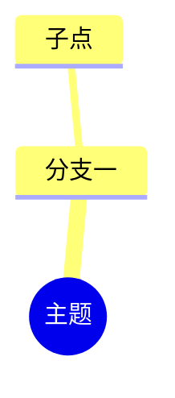

## 核心理念

三种渲染层级，按可用性从高到低：

| 场景 | 格式 | 风格 | 用途 |
|------|------|------|------|
| Excalidraw（已安装） | `.excalidraw` | 手绘风、彩色圆角卡片 | **思维导图**（层级树） |
| Obsidian 原生 Canvas | `.canvas` | 卡片 + 连线、可缩放 | **知识图谱**（概念关系图） |
| 任何环境兜底 | Mermaid | 笔记内嵌代码块 | 两者皆可 |

关键认知：Excalidraw 和 Canvas 都是 **JSON 文件格式**，直接用 Python 生成即可，打开时由插件/核心功能渲染——不需要也无法直接调用运行中的 Obsidian 进程。

## 工作流程

### 第一步：确定输入结构

- 优先从笔记的「二、知识逻辑链」提取：逻辑模块 = 顶层分支，模块内条目 = 子节点，条目下的说明 = 叶子
- 思维导图要**树形**结构（每节点只有一个父节点）
- 知识图谱要**图**结构（允许一个节点多个出边、跨层引用）

### 第二步：确认插件与选型

```bash
ls "~/Documents/Obsidian Vault/.obsidian/plugins/"
```

- 存在 `obsidian-excalidraw-plugin` → 思维导图用 Excalidraw
- 知识图谱一律用 Canvas（核心功能，无需插件）
- 用户明确要"笔记里直接能看"或环境无插件 → Mermaid

### 第三步：生成 Excalidraw 思维导图

**输出位置**：`{源笔记目录}/附件/`（**每门课一个「附件」子文件夹**——用户已确认的 vault 规范，主目录只放 .md），命名 `{笔记名}-思维导图.excalidraw`

**JSON 骨架**：

```json
{"type": "excalidraw", "version": 2, "source": "https://excalidraw.com",
 "elements": [...], "appState": {"gridSize": null, "viewBackgroundColor": "#ffffff"}, "files": {}}
```

**元素三件套**：
- `rectangle`：圆角色块 — `fillStyle: "solid"`、`roundness: {"type": 3}`、`strokeWidth: 2`
- `text`：居中文字，**绑定到容器**（插件原生格式，避免插件打开时重写/打乱元素）— `fontFamily: 2`、`textAlign: "center"`、`verticalAlign: "middle"`、`autoResize: false`、`containerId: {矩形id}`；矩形同时设置 `boundElements: [{"id": {文字id}, "type": "text"}]`
- `arrow`：父子连线 — `points: [[0,0],[dx,dy]]`、`endArrowhead: "triangle"`

**布局算法（右侧树，槽位法——防止兄弟子树重叠）**：
1. 根节点在左侧（x=40），子节点逐级向右：`child_x = parent_x + parent_w + 90`
2. 两遍扫描：
   - 第一遍自底向上算每个节点的**槽高**：`slot_h = max(自身高, Σ子槽高 + 20×(子数-1))`（必须取 max——单子节点的槽至少要有自己卡片高）
   - 第二遍自顶向下放置：**卡片在其槽内垂直居中**，**子块在其槽内垂直居中**——两层居中保证任何子树不越出自己的槽，兄弟子树间距恒 ≥ 20
3. 节点高度：根 50 / 分支 42 / 子节点 38 / 叶子 34；水平间距 GAP=90、垂直间距 VGAP=20、卡片内边距 48
4. 回归测试：生成后必须跑几何审计（卡片重叠=0、文字都在卡片内、箭头端点都在卡片边上）。v1 的教训：只把子块相对父卡片居中、未在槽内居中，导致"运算性质"的子块向上溢出压到前一个兄弟的子树，出现两张卡片叠在同一位置

**文本宽度估算**：CJK 字符 ≈ `1em`，ASCII ≈ `0.55em`；`节点宽 = 文本估算宽 + 48`（留足内边距；文字绑定容器后插件会自动微调）

**配色**：每个顶层分支一个色系，三元组 `(描边, 填充, 文字)`：
- 蓝 `("#2563eb", "#dbeafe", "#1e293b")`、橙 `("#ea580c", "#ffedd5", "#1e293b")`、绿 `("#16a34a", "#dcfce7", "#1e293b")`、紫 `("#7c3aed", "#ede9fe", "#1e293b")`
- 根节点深色底白字 `("#0f172a", "#0f172a", "#ffffff")`
- 深层叶子用白底 + 分支色描边

**杂项**：`id` = 10 位随机小写字母数字；`seed`/`versionNonce` 任意整数；`updated` = 毫秒时间戳；`version: 1`

### 第四步：生成 Canvas 知识图谱

**输出位置**：`{源笔记目录}/附件/`，命名 `{笔记名}-知识图谱.canvas`

**JSON 骨架**：

```json
{"nodes": [{"id": "n1", "type": "text", "text": "概念", "x": 40, "y": 300, "width": 180, "height": 72, "color": "2"}],
 "edges": [{"id": "e1", "fromNode": "n1", "fromSide": "right", "toNode": "n2", "toSide": "left", "label": "关系"}]}
```

- 节点 `color` 取 `"1"`~`"6"`（红橙绿青紫灰），按语义分组：前置=灰、核心=橙、产物=绿、应用=紫
- 文字用 `\n` 换行；节点宽 180~240、高 56~72
- 布局：按逻辑层级分列（同一层级同一 x），垂直错开，避免连线交叉
- 边的 `label` 可省略，关系明确时标注（如"模长""方向"）

### 公式卡片升级（matplotlib 渲染 LaTeX 图片）

- 触发：用户确认过渲染效果后，公式型卡片（如"大小：|a||b|·sinθ"、"力矩：M = r×F"）改为「文字标签 + 渲染图片」
- **Python 版本坑**：matplotlib 只装在 Python 3.13，`python` 命令指向 3.12 没有 matplotlib。渲染脚本必须用：
  `~/AppData/Local/Programs/Python/Python313/python.exe`
- 渲染：`fig.text(0.5, 0.5, r"$公式$", fontsize≈24, color="#1e293b", ha='center', va='center')` → `savefig(format='png', dpi=300, transparent=True, bbox_inches='tight', pad_inches=0.04)` → PIL 读宽高算纵横比
- 嵌入：image 元素（`status: "saved"` + `fileId`，`scale: [1,1]`）+ 顶层 `files` map（`mimeType: "image/png"` + `dataURL: "data:image/png;base64,..."`）
- 卡片结构：标签用**自由文字**（不绑定容器，位置确定）放卡片左侧，图片放其右侧；卡片宽 = 16 + 标签宽 + 10 + 图宽 + 16
- 图片显示尺寸：`disp_h = 卡片高 − 8`，`disp_w = disp_h × 纵横比`；文字颜色 #1e293b（深色，配浅色卡底）
- 生成后审计需额外检查：所有 image 元素在卡片内部、fileId 与 files 一一对应

### 第五步：兜底 Mermaid（笔记内嵌）



- `mindmap` 用于思维导图；`graph LR` 用于知识图谱
- 节点文本避免 `()` 等特殊字符，必要时用引号包裹；中文直接可用

### 第六步：链接进笔记并校验

1. 在笔记「三、知识图谱」「四、思维导图」章节末尾**内嵌 PNG 快照**（PNG 是 Obsidian 原生格式，永远能显示、不触发「解锁新格式」弹窗）：
   `> 知识图谱：![[10-数学基础/01-物理学的数学基础/附件/{文件名}.png]]（可编辑源：[[10-数学基础/01-物理学的数学基础/附件/{文件名}.canvas|Canvas]]）`
   `> 🧠 思维导图：![[10-数学基础/01-物理学的数学基础/附件/{文件名}.png]]（可编辑源：[[10-数学基础/01-物理学的数学基础/附件/{文件名}.excalidraw|Excalidraw]]）`
2. **PNG 快照渲染**（用 Python 3.13 跑，matplotlib）：读取生成的 .excalidraw JSON 数据，用 `FancyBboxPatch` 画圆角卡片 + 中文字体（`C:/Windows/Fonts/msyh.ttc` 微软雅黑）+ `annotate` 画箭头 + 公式 PNG 用 `imshow` 贴回原位；2 倍缩放、dpi=144、白底，存到 `附件/{文件名}.png`
2. 校验两个 JSON 文件可解析、元素数量合理：

```bash
python -c "
import json
for p in ['{思维导图路径}', '{知识图谱路径}']:
    d = json.load(open(p, encoding='utf-8'))
    print(p, 'OK', len(d.get('elements', d.get('nodes', []))))
"
```

3. 提醒用户打开 Obsidian 确认渲染效果（Excalidraw 卡片可拖动、Canvas 可缩放）

## 已知坑位（v1 实战教训）

- **内嵌弹「解锁新格式」/无法显示**：.excalidraw 不是 Obsidian 原生格式，内嵌 `![[x.excalidraw]]` 会触发核心的解锁确认，且依赖插件实时渲染。**笔记内一律内嵌 PNG 快照**，.excalidraw/.canvas 只作可编辑源文件链接（交互式编辑时点开源文件即可）
- **「兼容旧格式」提示（已确认的处理）**：Excalidraw 插件 2.25.3 的原生格式是 `.excalidraw.md`（frontmatter 标 `excalidraw-plugin: parsed` + 数据嵌 `%%` 注释块），经典 `.excalidraw` 纯 JSON 打开时会被提示"兼容模式/转换为新格式"。**用户已决定：保持 `.excalidraw` 经典格式**——插件只把 `.excalidraw` 扩展名注册给绘图视图，双击直接进绘图视图；兼容模式不影响查看/编辑/保存，提示可忽略。不要主动转换成 `.excalidraw.md`（双击会变成 markdown 文档，体验更差）
- **插件会改写文件**：Excalidraw 插件打开文件时会按自己的规范重写 JSON（文字宽度变为实测值、元素顺序变化、卡片位置可能被动）。现象：卡片文字宽度与生成值不一致、矩形与文字配对错乱。
- **再次生成前要求用户关闭 Obsidian 中打开的原文件**，否则插件可能用旧内容回写覆盖新文件
- 附件统一放 `{源笔记目录}/附件/`，笔记内用 `![[...]]` 内嵌引用（图直接显示在笔记里，不依赖文件名记忆）
- 卡片文字绑定容器（containerId + boundElements）是规避改写错乱的关键，生成后必须校验"所有文字有容器、所有卡片有绑定"
- 布局必须用槽位法并跑几何审计，不能只做视觉估算

## 注意事项

- **不要改动笔记的 Part 1 和既有逻辑链**，只追加链接行
- 生成脚本放系统临时目录（如 `~/AppData/Local/Temp/`），不要污染 vault
- Excalidraw 文本若含 `|`、`×`、`θ` 等符号直接使用即可（JSON 字符串内安全）
- 用户要求"更好看/可编辑"时优先 Excalidraw；要求"知识结构/关系"时优先 Canvas
- 此 skill 通常与「补全笔记逻辑链」配合：补完 Part 2 后，用户说"画个图/思维导图"即调用本 skill
